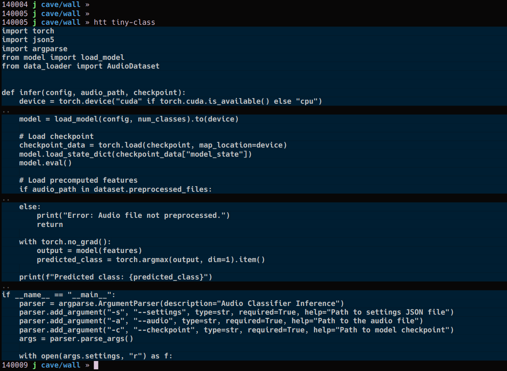

# `head-shoulders-knees-toes` (aka `htt` (head torso toes)

## Overview
`head-shoulders-knees-toes` (symlinked as `htt`) is a Perl script designed to preview a file's contents by displaying four evenly spaced chunks from the file in a terminal window. It properly accounts for terminal height, even when receiving piped input.

## Screenshot(s)


## Features
- Detects terminal height to determine optimal chunk sizes.
- Works with piped input or files.
- Displays four evenly spaced sections from the file.
- Preserves space for dividers and prompt return.

## Usage
```sh
cat largefile.txt | htt
htt < largefile.txt
htt largefile.txt
```

## Installation
1. Place `head-shoulders-knees-toes` in a directory in your `$PATH`.
2. Create a symlink:
```sh
ln -s head-shoulders-knees-toes htt
```
3. Make it executable:
```sh
chmod +x head-shoulders-knees-toes
```

## Example Output
```sh
{chunk0}
..
{chunk1}
..
{chunk2}
..
{chunk3}
```

## Notes
- This script respects terminal height and ensures content fits within the visible area.
- Ideal for quickly previewing large files.


